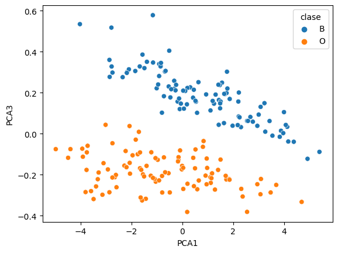
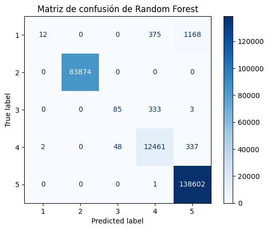

# Challenges de IA-Center con aprendizaje de máquina

En este curso impartido por el IA-Center en colaboración con BOSCH, se nos platicó y enseñó sobre lo que es la IA, el aprendizaje de máquina  e incluso del aprendizaje profundo. A continuación se presentan dos prácticas que involucran desarrollar modelos de aprendizaje de máquina. En [esta práctica](https://github.com/LuisGuillermoRL/Challenges_IA-Center-ML/blob/main/Ejercicio_1.ipynb) se nos encargó buscar un data set y describirlo para posteriormente trabajar con él y en esta [última práctica](https://github.com/LuisGuillermoRL/Challenges_IA-Center-ML/blob/main/PTfinal_.ipynb) se nos proporcionó un data set relacionado con datos del COVID en México y sin que se nos proporcionara información sobre los pacientes, se trabajó de tal manera de predecir un target, descartar ciertos tipos de datos, así como trabajar con fechas. Abajo se muestran dos imágenes: la que tiene aplicada la **técnica de PCA** pertenece a la primer práctica (lo cual ayudó a obtener una tasa alta de clasificación) y la matriz de confusión sobre los datos de validación de un modelo **Random Forest** fue obtenida de la posterior práctica mencionada.

